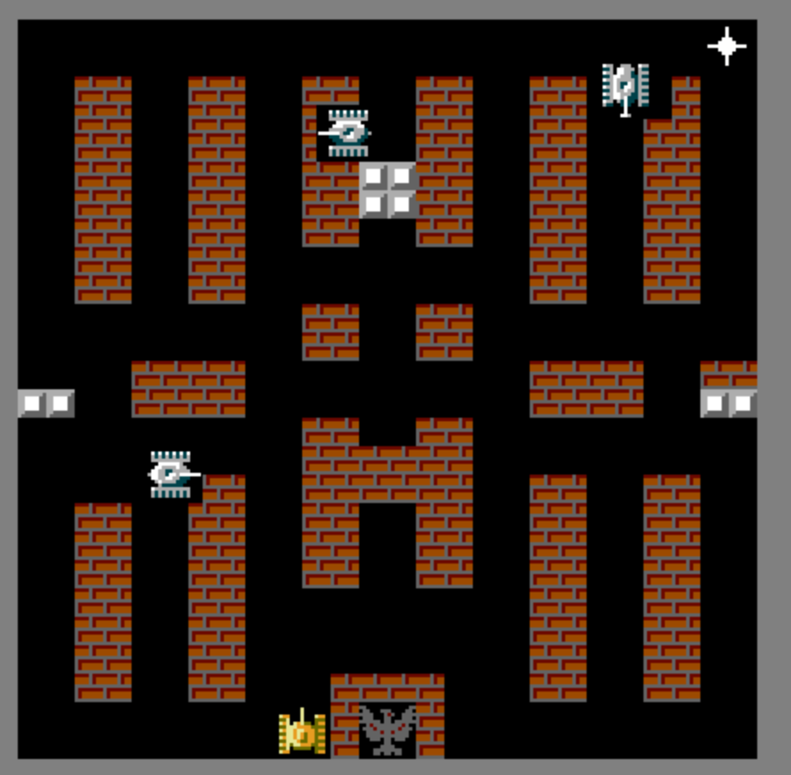

# Танчики на pygame!


Я попытался сделать игру Танчики на компьютер с помощью Python и библиотеки PyGame.

### Как запустить?

У вас должны быть установлены Python и PyGame.

```
pip install -r requirements.txt
```

Запускайте:

```
python main_menu.py
```
В игре есть враги и главный танк, главный танк должен убить нужное количество вражеских танков для победы и не умереть.
Также есть знамя - орёл, которые должен охранять главный танк, если знамя разрушат игру будет проиграна.
В игре есть бонусы, которые помогут главному танку победить.
Присутствуют разные типы блоков: кирпичи, которые можно разрушать, стальные блоки, вода, трава и гравий.
Враги пользуются специальной программой, которая заставляет их стрелять, ломать стены и выбирать направление в тупике.

Нужно набрать 2000 очков для победы, не умерев при этом 3 раза.
WASD - вперед, влево, назад и вправо соответсвенно.
Стрельба - пробел.
Присутсвует 4 уровня.

Скриншот:


